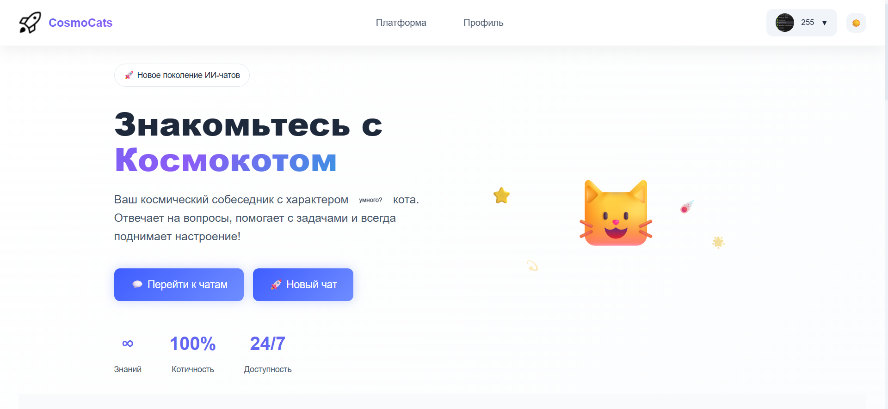

# CosmoCats

**CosmoCats** — веб-приложение на Flask, в котором можно общаться с локальной нейросетью через браузер.  
Проект сделан в учебных целях, чтобы научиться связывать веб-интерфейс с моделью машинного обучения.

## Что умеет

- Регистрация и вход в личный кабинет (пароли хранятся в зашифрованном виде).
- Смена имени, пароля и генерация случайного аватара.
- Чат с нейросетью на основе модели `ai-forever/rugpt3small_based_on_gpt2` (вес ~500 МБ).
- Модель скачивается автоматически при первом обращении и сохраняется локально (кэш).
- Вся история переписки хранится в базе данных SQLite.
- Можно переключать светлую и тёмную тему.
- Интерфейс подстраивается под экран (адаптивный).

## Технологии

- **Бэкенд:** Python 3, Flask, SQLite.
- **Нейросеть:** Hugging Face Transformers, PyTorch (CPU).
- **Фронтенд:** HTML, CSS, JavaScript (средства Flask — Jinja2).
- **Инструменты:** Git, виртуальное окружение.

## Установка и запуск

1. **Скопируйте репозиторий**:
   ```bash
   git clone https://github.com/255jli/Website_CosmoCats_Project.git
   cd Website_CosmoCats_Project
   ```

2. **Создайте виртуальное окружение**:

   - Для Windows (PowerShell):
     ```powershell
     python -m venv .venv
     .\.venv\Scripts\Activate.ps1
     ```
   - Для Linux / Mac:
     ```bash
     python -m venv .venv
     source .venv/bin/activate
     ```

3. **Установите зависимости**:
   ```bash
   pip install -r requirements.txt
   ```

4. **Запустите сервер**:
   ```bash
   python app.py
   ```
   Затем откройте в браузере `http://127.0.0.1:5000`

### Загрузка модели

При первом обращении к чату или странице `/platform` приложение самостоятельно загрузит модель (~500 МБ) из Hugging Face — это может занять 2–5 минут в зависимости от скорости интернета. После загрузки интернет не нужен. Если интернет отсутствует, включится упрощённый режим (случайные ответы).

> **📌 Обратите внимание**  
> Есть **российское зеркало** модели (доступно уже более года) на платформе Yandex Disk — если автоматическая загрузка не работает, скачайте архив по ссылке  
> **[https://disk.yandex.ru/d/vUU3mOk0LfrVdQ](https://disk.yandex.ru/d/vUU3mOk0LfrVdQ)**  
> и распакуйте его в папку `model_cache/` внутри проекта.

## Структура проекта (кратко)

- `app.py` — главный файл, запускает сервер.
- `ai_core.py` — отвечает за нейросеть (загрузка, генерация ответов).
- `auth_manager.py` — вход и регистрация.
- `db_manager.py` — работа с базой данных.
- `profile_manager.py` — управление профилем (имя, пароль, аватар).
- `chat_manager.py` — создание и история чатов.
- `templates/` — HTML-страницы.
- `static/` — стили и скрипты.
- `assets/` — картинки-заглушки.
- `model_cache/` — папка с моделью (не сохраняется в Git).
- `requirements.txt` — список нужных библиотек.

## Галерея




## Участники

- [alikhn11](https://github.com/alikhn11) — дизайн, страницы index.html, base.html
- [timurkoblov-rgb](https://github.com/timurkoblov-rgb) — дизайн, страницы login.html, register.html

## О разработке

Проект начат в ноябре 2025 года как учебная работа. Весь код написан с использованием ИИ-ассистентов **DeepSeek** и **Qwen Studio** (ранее — Qwen.ai), последние доступные версии с вебсайтов на тот момент.

## Статус

Репозиторий заархивирован. Проект завершён и больше не дорабатывается, но может быть полезен как отправная точка для собственных учебных экспериментов. Выложен для ознакомления и распространяется под лицензией MIT.

